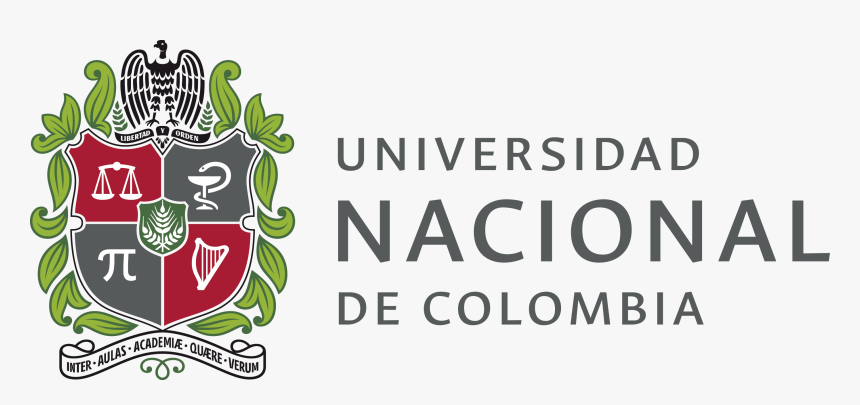

  

# Universidad Nacional de Colombia

## Programación Orientada a Objetos 2026-2S

- **Descarga de todas las actividades:** [Actividades](https://github.com/dvilladasa-hub/Programacion_Orientada_a_Objetos_2026_2S/archive/refs/heads/main.zip)
- **Nombre completo del estudiante:** Daniel Augusto Villada
- **Nombre completo del docente:** Walter Hugo Arboleda Mazo

+
<b>Actividad 1</b>

- [ejercicio 4.py](https://github.com/dvilladasa-hub/Programacion_Orientada_a_Objetos_2026_2S/raw/main/ejercicio%204.py)
- [ejercicio 5.py](https://github.com/dvilladasa-hub/Programacion_Orientada_a_Objetos_2026_2S/raw/main/ejercicio%205.py)
- [ejercicio 12.py](https://github.com/dvilladasa-hub/Programacion_Orientada_a_Objetos_2026_2S/raw/main/ejercicio%2012.py)
- [ejercicio 14.py](https://github.com/dvilladasa-hub/Programacion_Orientada_a_Objetos_2026_2S/raw/main/ejercicio%2014.py)
- [ejercicio 17.py](https://github.com/dvilladasa-hub/Programacion_Orientada_a_Objetos_2026_2S/raw/main/ejercicio%2017.py)

 

+
+

+
<b>Actividad 2</b>

+
+- [ejercicio 2.1.py](https://github.com/dvilladasa-hub/Programacion_Orientada_a_Objetos_2026_2S/raw/main/ejercicio%202.1.py)
+- [ejercicio2.2.py](https://github.com/dvilladasa-hub/Programacion_Orientada_a_Objetos_2026_2S/raw/main/ejercicio2.2.py)
+- [ejercicio 2.3.py](https://github.com/dvilladasa-hub/Programacion_Orientada_a_Objetos_2026_2S/raw/main/ejercicio%202.3.py)
+- [ejercicio 2.4.py](https://github.com/dvilladasa-hub/Programacion_Orientada_a_Objetos_2026_2S/raw/main/ejercicio%202.4.py)
+- [ejercicio 2.5.py](https://github.com/dvilladasa-hub/Programacion_Orientada_a_Objetos_2026_2S/raw/main/ejercicio%202.5.py)
+
+

